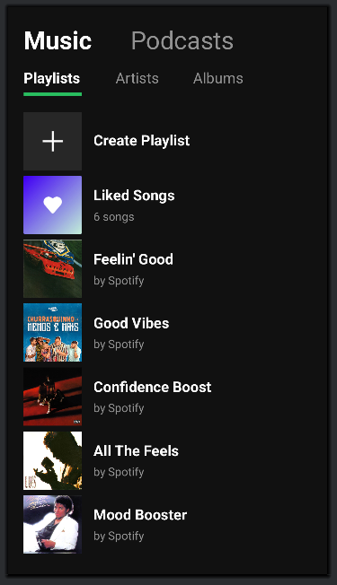

# tela-spotify
Essa foi uma atividade passada em sala da disciplina de Programação de Dispositivos Móveis. O objetivo era construir uma tela estática semelhante à uma das telas do app Spotify, por meio do Android Studio.

 

## 📸 Screenshot Final

## 🖥️ Tecnologias Utilizadas
IDE:

Linguagens:

          
          
          
